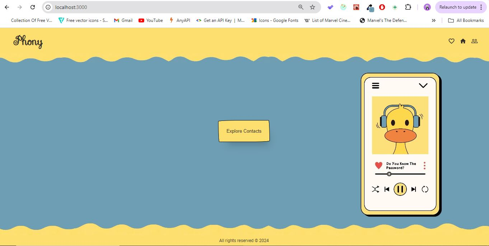

# Phony

## Overview

Phony is a web application designed to display cards for contact users, providing an easy-to-use interface for managing and viewing contact information.

## Requirements

- **Node.js**: Version 14 or higher is required.

## Scripts

- **Start the Application**: To run the application in development mode, use the following command:

  ```bash
  npm run start
  
- **Generate Documentation**: use the following command:

  ```bash
  npm run doc

## Features
Add contact
Edit contact
Favorite contacts
Filter contacts

## Demo : [click here](https://contacts-virid-two.vercel.app/)


